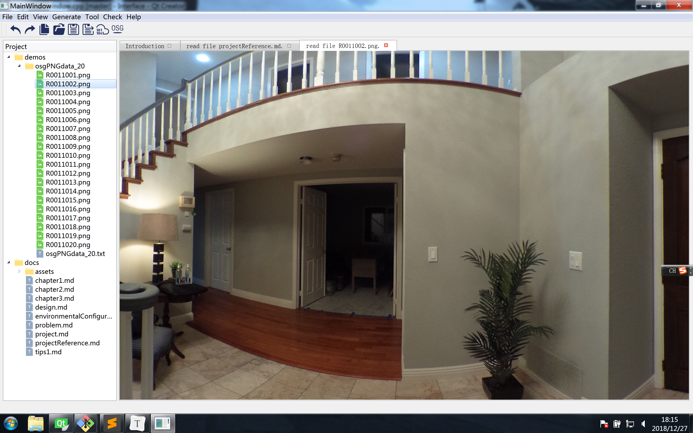
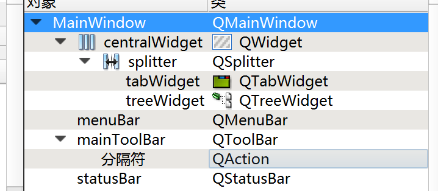

### 应用基本框架设计

* 在[上文](./chapter2.md)中介绍了`osg`控件与原生`qt`控件的联合使用，下面开始一个完整的应用的开发

  

* 目前基本设计如下：左侧为项目视图，右侧为工作区

* 关于`ui`中的设计如下：对于`QtCreator`的布局的方式可参考：

  * 关于布局方式：
    - `http://www.voidcn.com/article/p-dojiflff-bhr.html`
    - `https://www.cnblogs.com/qiaozhoulin/p/4528002.html`
  * 最终可以实现控件随着程序变化而实现大小的变化，以下是`ui`文件的内容

  

* 其中部分代码如下所示：

  ```C++
  MainWindow::MainWindow(QWidget *parent) :
      QMainWindow(parent),
      ui(new Ui::MainWindow), m_fileTree(m_namePool),textEdit(new QPlainTextEdit){
      ui->setupUi(this);
      this->resize( QSize( 1200, 900 ));
      this->setWindowState(Qt::WindowMinimized);
      ui->splitter->setStretchFactor(0, 3);
      ui->splitter->setStretchFactor(1, 14);
      CreateMenu();
      CreateToolBar();
      CreateStatusBar();
      CreateTreeView();
      CreateTableView();
  
  }
  
  void MainWindow::CreateTableView(){
      pTabWidget = ui->tabWidget;
      m_pictureBox = new PictureBox();
      pTabWidget->addTab(new GeneralTab(), tr("Introduction"));
      ui->tabWidget->setCurrentIndex(ui->tabWidget->count() - 1);
      pTabWidget->setTabsClosable(true);
      connect(pTabWidget,SIGNAL(tabCloseRequested(int)),this,
              SLOT(removeSubTab(int)));
  }
  
  void MainWindow::CreateTreeView(){
      pTreeWidget = ui->treeWidget;
      pTreeWidget->setColumnCount(1);
      QFile file("./defaultTree.txt");
      if(file.open(QIODevice::ReadOnly)){
          QDomDocument dom("WCM");
          if (dom.setContent(&file)){
              ui->treeWidget->clear();
              QDomElement docElem = dom.documentElement();
              listDom(docElem, NULL);
          }
      }
      file.close();
      connect(pTreeWidget,SIGNAL(itemClicked(QTreeWidgetItem*,int)), this,SLOT(checkself(QTreeWidgetItem* ,int)));//检测点击事件，信号槽机制
      connect(pTreeWidget,SIGNAL(customContextMenuRequested(const QPoint&)), this,SLOT(popMenu(const QPoint&)));//检测鼠标右键
  }
  ```