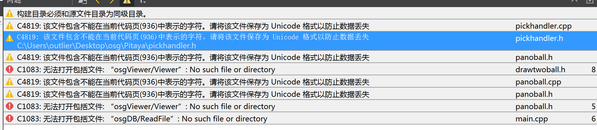

### 项目引入

- 导入项目

  - 直接导入项目会出现：

    

  - 原因在于对于上述在[环境配置](./environmentalConfiguration.md)中未加入对相关库的**引用**

- 对于`pro`项目中应该加入引用**设置**

  ```c++
  win32:CONFIG(release, debug|release): LIBS += -L$$PWD/../OpenSceneGraph-3.6.1_lib_qt/lib/ -losg
  else:win32:CONFIG(debug, debug|release): LIBS += -L$$PWD/../OpenSceneGraph-3.6.1_lib_qt/lib/ -losgd
  else:unix: LIBS += -L$$PWD/../OpenSceneGraph-3.6.1_lib_qt/lib/ -losg
  
  INCLUDEPATH += $$PWD/../OpenSceneGraph-3.6.1_lib_qt/include
  DEPENDPATH += $$PWD/../OpenSceneGraph-3.6.1_lib_qt/include
  
  win32:CONFIG(release, debug|release): LIBS += -L$$PWD/../osgQt_lib/lib/ -losgQt5
  else:win32:CONFIG(debug, debug|release): LIBS += -L$$PWD/../osgQt_lib/lib/ -losgQt5d
  else:unix: LIBS += -L$$PWD/../osgQt_lib/lib/ -losgQt5
  
  INCLUDEPATH += $$PWD/../osgQt_lib/include
  DEPENDPATH += $$PWD/../osgQt_lib/include
  ```

  ​	

  - 其中`$$PWD`表示当前的工作目录，在这里要做一个**相对地址**的引用，当前项目地址

    

  - 后续直接运行即可

