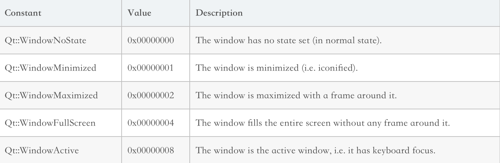

### 窗体设置

* 对于窗体初始运行时状态的设置：

  `void QWidget::setWindowState ( Qt::WindowStateswindowState)`函数

  

* `resizeColumnToContents`函数：根据内容自动调整大小

* 关于布局方式：

  * `http://www.voidcn.com/article/p-dojiflff-bhr.html`
  * `https://www.cnblogs.com/qiaozhoulin/p/4528002.html`

* 关于`QTreeWidgetItem`的使用：

  * `https://blog.csdn.net/bzhxuexi/article/details/10054343`
  * `https://www.cnblogs.com/ling123/p/5503465.html`
  * `http://www.voidcn.com/article/p-nkqkbdev-bcr.html`
